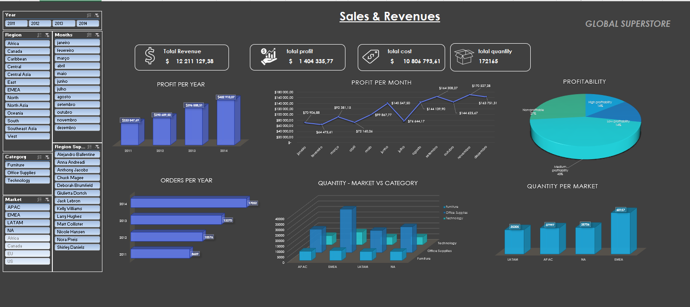

# Excel Sales Dashboard – Global Superstore

## Project Overview
This project consists of a **sales analysis and dashboard built in Microsoft Excel** using the **Global Superstore** dataset.  
The project was developed as part of a **Data Analyst training program** and focuses on data preparation, validation, analysis, and dashboard creation to support business decision-making.

The main objective was to transform raw transactional data into **clear insights and KPIs** for management.

---

## Business Objectives
- Analyze sales performance after offsetting returns  
- Evaluate profitability across markets, regions, and product categories  
- Monitor revenue, profit, cost, and quantity sold over time  
- Support management with a dynamic and interactive dashboard  

---

## Dataset
- **Dataset:** Global Superstore (educational dataset)
- **Sheets used:**
  - `Orders` – Sales transactions  
  - `Returns` – Returned orders  
  - `People` – Regional supervisors  
- **Data content:** Sales, profit, quantity, cost, returns, regions, markets, categories, and time dimensions  

---

## Data Preparation
The following data preparation steps were performed in Excel:
- Created backup copies of all original sheets  
- Converted all datasets into **Excel Tables**  
- Reviewed and validated data consistency across all sheets  
- Merged **Region Supervisor** information from the People sheet into Orders  
- Integrated **Returns** data into the Orders sheet, handling:
  - Duplicate Order IDs across different Markets  
  - Multiple returns for the same order  
- Standardized Market names to ensure consistency  
- Created calculated fields, including:
  - Total sales after offsetting returns  
  - Total profit after offsetting returns  
  - Total quantity sold after offsetting returns  
  - Total cost of sales  
  - Profit percentage (with error handling)

---

## Business Questions & Analysis
The analysis addressed the following business questions:
- Distribution of order quantities by **Market**  
- Distribution of profitability levels (Non-profitable, Low, Medium, High)  
- Total orders and profit by **Year**  
- Profit distribution by **Month**  
- Quantity sold by **Category and Market**  

All questions were answered using **Pivot Tables and Pivot Charts**.

---

## Dashboard & KPIs
A dynamic Excel dashboard was built to support management monitoring, including:
- **Total Revenue (after returns)**  
- **Total Profit (after returns)**  
- **Total Cost of Sales**  
- **Total Quantity Sold**  

The dashboard includes **interactive slicers** for:
- Year  
- Month  
- Market  
- Region  
- Regional Supervisor  
- Category  

---

## Dashboard Preview
Below is a preview of the final Excel dashboard:

---

## Tools Used
- **Microsoft Excel**
  - Tables
  - Advanced formulas (IF, VLOOKUP, CONCAT)
  - Pivot Tables & Pivot Charts
  - Slicers
  - Dashboard design

---

## Repository Structure
├── data/

│ └── README.md

├── excel/

│ └── README.md

├── dashboard/

│ └── dashboard_preview.png

└── README.md

---

## What I Learned
- Data cleaning and validation in Excel  
- Handling duplicates and inconsistencies across multiple datasets  
- Creating business KPIs using formulas  
- Building interactive dashboards with Pivot Tables and slicers  
- Translating business questions into analytical insights  

---

## Author
**Luís Machado**  
Junior Data Analyst  

**Tools:** SQL | Excel | Power BI | Python  
